<!-- © 2025 Ing. David Jaroš — CC BY-NC-ND 4.0 -->
<!-- Auto-generated by tools/generate_theory_map.py — do not edit manually -->

# UBT Theory Status Map

*Auto-generated from [`DERIVATION_INDEX.md`](../DERIVATION_INDEX.md). Do not edit manually — run `python tools/generate_theory_map.py` to regenerate.*

## Status Legend

| Symbol | Meaning |
|--------|---------------------------|
| ✅ | **Proved** — rigorous derivation, no free parameters |
| ⚡ | **Supported** — numerical / structural evidence |
| ⚠️ | **Semi-empirical** — structural derivation with ≥1 free parameter |
| ❌ | **Open Hard Problem** — no known derivation |
| 💭 | **Conjecture** — proposed, derivation pending |

## Theory Map

```mermaid
graph TD

    %% Algebra
    A["ℂ⊗ℍ Algebra"]
    A --> B["✅ SU(2)_L"]
    A --> C["✅ U(1)_Y"]
    A --> D["✅ U(1)_EM"]
    A --> E["⚠️ SU(3)_c"]
    A --> F["✅ Associativity"]

    %% Gravity
    G["Gravitace"]
    G --> H["✅ G_μν vakuum"]
    G --> I["✅ G_μν + hmota"]
    G --> J["✅ ∇^μ T_μν = 0"]

    %% Three Generations
    K["Tři generace"]
    K --> L["✅ ψ-módy nezávislé"]
    K --> M["✅ T-invariance"]
    K --> N["⚡ Hecke konjektura"]
    K --> O["⚡ hmotnostní poměry"]

    %% Constants
    P["Konstanty"]
    P --> Q["⚠️ α⁻¹ = 137 bare"]
    P --> R["✅ N_eff = 12"]
    P --> S["✅ B₀ = 8π"]
    P --> T["❌ B_phenom"]

    %% Cosmology
    U["Kosmologie"]
    U --> V["💭 CMB predikce"]
    U --> W["💭 ΔN_eff"]

    %% Style classes
    classDef proved       fill:#90EE90,stroke:#228B22,color:#000
    classDef supported    fill:#FFD700,stroke:#DAA520,color:#000
    classDef semiempirical fill:#FFA500,stroke:#FF8C00,color:#000
    classDef openhard     fill:#FF6B6B,stroke:#DC143C,color:#000
    classDef conjecture   fill:#C0C0C0,stroke:#808080,color:#000
    classDef unknown      fill:#EEEEEE,stroke:#AAAAAA,color:#000

    class B proved
    class C proved
    class D proved
    class E semiempirical
    class F proved
    class H proved
    class I proved
    class J proved
    class L proved
    class M proved
    class N supported
    class O supported
    class Q semiempirical
    class R proved
    class S proved
    class T openhard
    class V conjecture
    class W conjecture
```

## Summary

| Area | Proved | Supported | Semi-empirical | Open |
|------|--------|-----------|----------------|------|
| Algebra | 9 | 0 | 3 | 1 |
| Gravity | 8 | 0 | 0 | 1 |
| Generations | 5 | 1 | 0 | 2 |
| Constants | 7 | 0 | 3 | 2 |
| Cosmology | 0 | 0 | 0 | 2 |
| **Total** | **29** | **1** | **6** | **8** |

---

*See also: [`THEORY_STATUS_SUMMARY.md`](THEORY_STATUS_SUMMARY.md) for the plain-text table.*
